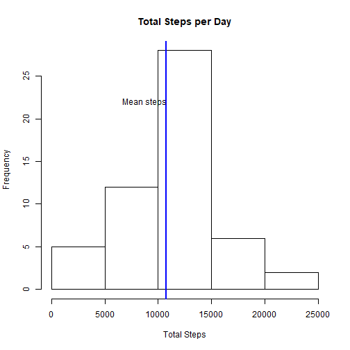

```r
library(knitr)

opts_chunk$set(fig.path = "figure/") 
opts_chunk$set(fig.ext = "png")
opts_chunk$set(fig.show = "hold")
print(opts_chunk$get("fig.path"))
```

```
## [1] "figure/"
```

We will look to walk through some initail exploratory analyis on data from wearable tech
devices


## Loading and Processing Data

This assignment makes use of data from a personal activity monitoring device. 
This device collects data at 5 minute intervals through out the day. The data 
consists of two months of data from an anonymous individual collected during the
months of October and November, 2012 and include the number of steps taken in 5 
minute intervals each day.


Here we will simple unzip and read in the 


```r
library("utils")

 unzip("activity.zip", files = NULL, list = FALSE, overwrite = TRUE,
              junkpaths = FALSE, exdir = ".", unzip = "internal",
              setTimes = FALSE)

 activity <- read.csv("activity.csv", header = TRUE, stringsAsFactors = FALSE) 
 
 str(activity)
```

```
## 'data.frame':	17568 obs. of  3 variables:
##  $ steps   : int  NA NA NA NA NA NA NA NA NA NA ...
##  $ date    : chr  "2012-10-01" "2012-10-01" "2012-10-01" "2012-10-01" ...
##  $ interval: int  0 5 10 15 20 25 30 35 40 45 ...
```

The data currently contains a lot on NAs and are not of the right class. For now
will ignore the NAs and change our data classes.

We will also transform the data for use later on


```r
library(dplyr)
```

```
## 
## Attaching package: 'dplyr'
```

```
## The following objects are masked from 'package:stats':
## 
##     filter, lag
```

```
## The following objects are masked from 'package:base':
## 
##     intersect, setdiff, setequal, union
```

```r
activitydate <- as.Date(activity$date, format = "%Y-%m-%d")

activity$interval <- as.factor(activity$interval)

activity_Clean <- filter(activity, !is.na(steps))


#Aggregate for total steps

Agg_Act<-  activity_Clean %>%
                group_by(date) %>%
                summarise(TotalStep = sum(steps))

#Aggregate for interval averages

Int_act <- activity_Clean %>%
                group_by(interval) %>%
                summarise(MeanSteps = mean(steps),
                          medianSteps = median(steps))
```


## What is mean total number of steps taken per day?

let's have a look at the distribution of this data by creating a histogram
and looking at the mean and median number of steps per day


```r
with(Agg_Act, hist(TotalStep, main = "Total Steps per Day", xlab = "Total Steps"))

with(Agg_Act, abline(v = mean(TotalStep), col = "blue", lwd = 2))
text(x = 8700, y = 22, "Mean steps")
```

<!-- -->


```r
meanSteps <- mean(Agg_Act$TotalStep)
medianSteps <- median(Agg_Act$TotalStep)
```

from the plot above we can see the total steps per day looks to be normally 
distributed. This is supported by the close proximity of the mean and median. 

Mean number of steps = 1.0766189\times 10^{4}
Median numbers of steps = 10765


## What is the average Daily Pattern?

Here by construction of a time series plot we will look to see which interval
on average has the maximum number of steps 


```r
png('figure/plot2.png')
with(Int_act, plot(x = interval, y = MeanSteps, type = "n",
                   main = "Average Number of Steps in 5 min Intervals",
                   xlab = "Interval", ylab = "Average Number of Steps"))
with(Int_act, lines(x = interval, y = MeanSteps, type = "l"))
dev.off()
```

```
## png 
##   2
```

```r
MaXInt <- Int_act[which.max(Int_act$MeanSteps),1]
```

From the above time series plot we can see the 5 minute interval with the maxium
number of average steps is 835 


## Imputing missing values

Let's go back to our original data which contain the missing values, now instead
of ignoring them, let's impute these values. I will use the median of an interval 
as the imputed value


```r
Median_Vals <- Int_act[,c(1,3)] #take median values per interval

activity_Imp <- merge(activity, Median_Vals, by = "interval") #merge with orig data

act_Imp <- mutate(activity_Imp, steps = ifelse(is.na(steps), medianSteps, steps)) 
```

With our imputed values Let's see if it makes a difference on the totals and 
averages per day


```r
Agg_Act2<-  act_Imp %>%
                group_by(date) %>%
                summarise(TotalStep = sum(steps))
png('figure/plot3.png')

with(Agg_Act2, hist(TotalStep, main = "Total Steps per Day", xlab = "Total Steps"))
with(Agg_Act2, abline(v = mean(TotalStep), col = "blue", lwd = 2))
with(Agg_Act2, abline(v = median(TotalStep), col = "orange", lwd = 2))
text(x = 8400, y = 22, "Mean")
text(x = 11500, y = 25, "Median")
dev.off()
```

```
## png 
##   2
```

```r
ImpmeanSteps <- mean(Agg_Act2$TotalStep)
ImpmedianSteps <- median(Agg_Act2$TotalStep)
```

From our historgram above we can see that imputing the values with the median
has resulted in the data becoming more right skewed.

The median stays the same as expecated at 10395 but we can see the 
skew by looking at the mean which has shifted to 9503.8688525 from 
1.0766189\times 10^{4}. 


## Are there differences in activity patterns between weekdays and weekends?

With our imputed data set let's now look to see if there looks to be any 
differences in activity in the week to weekends

First we will add a variable to denote if a date is week or weekend then compare
the average number of steps taken in each interval


```r
Week <- c("Monday", "Tuesday", "Wednesday", "Thursday", "Friday")

Weekend <- c("Saturday", "Sunday")

act_Imp$date <- as.Date(act_Imp$date, format = "%Y-%m-%d")

Act_Day_Type <- act_Imp %>% mutate(Day = weekdays(date), 
                                   DayType = ifelse(Day %in% Week, "Week", 
                                                    "Weekend"))
SUMAct_Day_Type <- Act_Day_Type %>%
                        group_by(interval,DayType) %>%
                        summarise(MeanSteps = mean(steps))


png('figure/plot4.png')

library(lattice) 
xyplot(SUMAct_Day_Type$MeanSteps ~ SUMAct_Day_Type$interval | SUMAct_Day_Type$DayType, 
       layout=c(1,2), 
       type="l",
       xlab = "Interval",
       ylab = "Number of steps")
dev.off()
```

```
## png 
##   2
```

Our plot shows that activity at the weekend is more constant throughout the day
where as during the week there is a spike in the mornings
